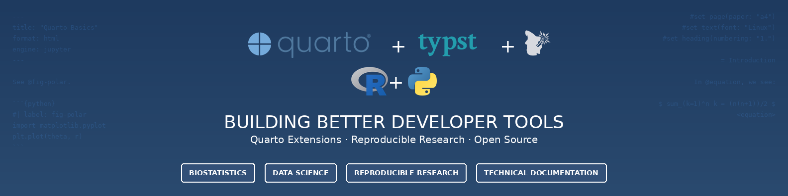

<h1 align="center">Hi 👋, I am Mickaël!</h1>

  <strong><i>Ph.D.</i> in Biostatistics · Quarto Wizard · Cinephile</strong>

  
  
   
  
  

    <picture>
      
    </picture>

## About Me

Consultant in **Biostatistics** and **freelance** developer specialising in Quarto and R ecosystems.
I combine expertise in genetics and multi-omics analysis with open-source development.

> [!NOTE]
> **Available for Quarto related projects.**

**49 peer-reviewed papers**[^1] in top-tier journals including Nature and Nature Genetics ([latest in Nature Communications, 2024](https://doi.org/10.1038/s41467-024-53687-3)[^2]).

[^1]: 8 as first/co-first/last/co-last author.

[^2]: as co-last author.

## Open Source

- **Creator** of [Quarto Extensions Directory](https://m.canouil.dev/quarto-extensions/) and [Awesome Quarto](https://github.com/mcanouil/awesome-quarto).
- **Developer** of [Quarto Wizard](https://github.com/mcanouil/quarto-wizard) VS Code extension and 15+ Quarto extensions.
- **Creator** of R packages: [insane](https://github.com/mcanouil/insane), [NACHO](https://github.com/mcanouil/NACHO).

## Skills

- **Statistical Analysis** · Genetics · Multi-omics · Longitudinal & Mixed Models · Data Visualisation
- **Development** · R & Python · HTML/CSS/JavaScript · VS Code Extensions
- **Publishing** · Quarto (HTML, PDF, Reveal.js) · Websites · Books
- **Infrastructure** · Docker · Dev Containers · CI/CD · GitHub · Google Cloud Platform · Shiny Dashboards/Applications

## Personal

When I am not working, I enjoy watching films () and playing with my black Labrador Retriever named Saga.

  <a href="https://github.com/mcanouil/imdb-ratings" target="_blank">
    <picture>
      <source media="(prefers-color-scheme: dark)" srcset="https://raw.githubusercontent.com/mcanouil/imdb-ratings/main/media/streak-dark.svg">
      <source media="(prefers-color-scheme: light)" srcset="https://raw.githubusercontent.com/mcanouil/imdb-ratings/main/media/streak-light.svg">
      
    </picture>
  </a>

