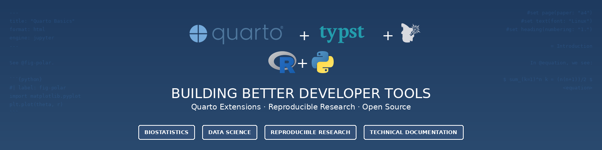

<h1 align="center">Hi 👋, I am Mickaël!</h1>

  <strong><i>Ph.D.</i> in Biostatistics · Quarto Wizard · Cinephile</strong>

  
  
  
   
  
  
  

    <picture>
      
    </picture>

## About Me

**Senior biostatistician** at [Alsinova (Astek)](https://www.alsinova.com/) and, separately, a **freelance** developer specialising in the Quarto and R ecosystems.
I combine expertise in genetics and multi-omics analysis with open-source development.

> [!NOTE]
> **Available as a freelance for short-term and extended engagements.**
> Quarto extensions and multi-format pipelines (HTML, Typst/PDF, Reveal.js), R package development, `shiny` applications, reproducible workflows with Dev Containers and continuous integration, and training.
> Biostatistics, clinical, and data-analysis work goes through Alsinova rather than my freelance offer.

**50 peer-reviewed papers** in top-tier journals, including **Nature**, **Nature Genetics**, and **Diabetes**.
Eight of those place me as first, co-first, last, or co-last author.

## Open Source

- **Creator** of the [Quarto Extensions Directory](https://m.canouil.dev/quarto-extensions/) and [Awesome Quarto](https://github.com/mcanouil/awesome-quarto).
- **Developer** of the [Quarto Wizard](https://github.com/mcanouil/quarto-wizard) VS Code extension, 30+ Quarto extensions, and [Gribouille](https://github.com/mcanouil/gribouille), a grammar of graphics for Typst.
- **Creator** of R packages: [NACHO](https://github.com/mcanouil/NACHO), [insane](https://github.com/mcanouil/insane), [MiSTr](https://github.com/mcanouil/MiSTr), [snpEnrichment](https://github.com/mcanouil/snpEnrichment), and [ggpacman](https://github.com/mcanouil/ggpacman).

## Skills

- **Statistics** · GWAS & EWAS · Multi-omics · Mixed models · Joint models · Survival analysis · Meta-analysis
- **Languages** · R · Lua · Typst · Python · TypeScript · JavaScript · Bash · SQL
- **Publishing** · Quarto · Typst · Reveal.js · Pandoc · LaTeX · R Markdown · HTML/(S)CSS
- **Infrastructure** · GitHub Actions · GitHub Pages · Docker · Dev Containers · Google Cloud · VS Code / Positron
- **R ecosystem** · tidyverse · shiny · devtools · testthat · roxygen2 · Bioconductor · renv · targets

## Personal

Away from the keyboard I watch a lot of films (), about half of them in a theatre.
I also play board games, from heavy strategy to party games, and walk Saga, my black Labrador Retriever.

  <a href="https://github.com/mcanouil/imdb-ratings" target="_blank">
    <picture>
      <source media="(prefers-color-scheme: dark)" srcset="https://raw.githubusercontent.com/mcanouil/imdb-ratings/main/media/streak-dark.svg">
      <source media="(prefers-color-scheme: light)" srcset="https://raw.githubusercontent.com/mcanouil/imdb-ratings/main/media/streak-light.svg">
      
    </picture>
  </a>

